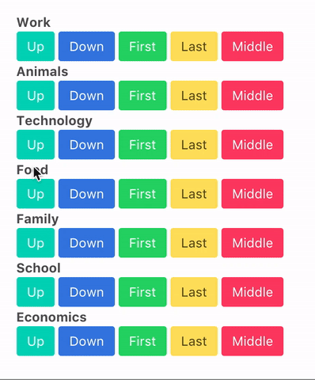
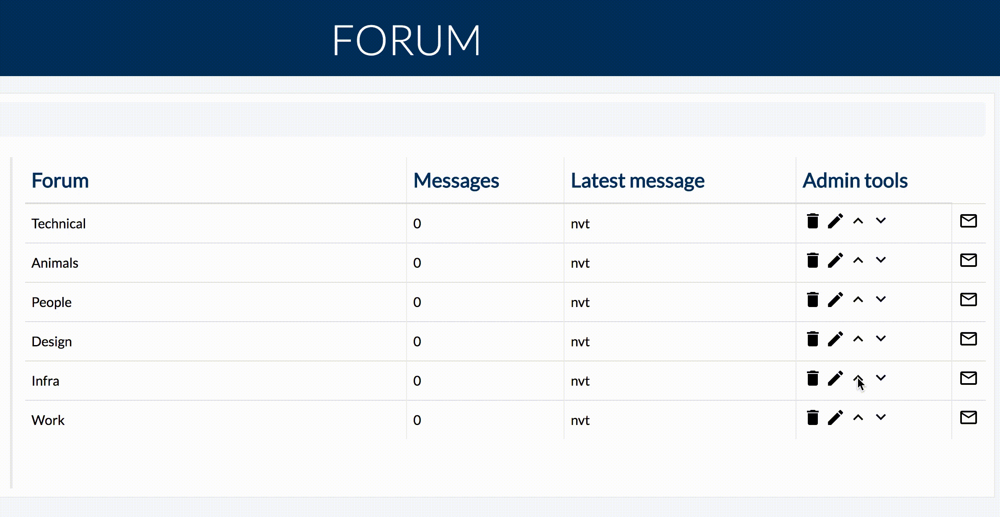

# Laravel 5.4 sorting rows like a boss

[](LICENSE.md)
[](https://styleci.io/repos/83806754)
[](https://scrutinizer-ci.com/g/larsjanssen6/increment-decrement/?branch=master)
[](https://scrutinizer-ci.com/g/larsjanssen6/increment-decrement/build-status/master)

This Laravel >=5.4 package allows you to sort your rows very easy. You can play with the
rows in a lot of ways. 

Example:



Once installed you can do the following:

```
Order::increment($model);
Order::decrement($model);
Order::toFirst($model);
Order::toLast($model);
Order::toMiddle($model);
Order::switchModels($model1, $model2);
Order::switchIndexes($model, $index1, $index2);
```
 
 The model (table) you want to sort needs a sort column. You can 
 specifiy your column in the ```increment-decrement``` located in ```config/increment-decrement.php```. Here you can set a 
 ```$xslt
order_column_name
```

The default ```order_column_name``` is obviously ```order```.

# Install

You can install the package via composer:

``` bash
$ composer require larsjanssen6/increment-decrement
```

This ```service provider``` must be installed.

```php
// config/app.php
'providers' => [
    ...
    LarsJanssen\IncrementDecrement\IncrementDecrementServiceProvider::class,
];
```

This package has a facade. Add it to the aliases array: 

```
// config/app.php
'aliases' => [
    ...
    'Order' => LarsJanssen\IncrementDecrement\OrderFacade::class,
]
```

You can publish the config-file with:

```$xslt
php artisan vendor:publish --provider="LarsJanssen\IncrementDecrement\IncrementDecrementServiceProvider" --tag="config"
```

This is the contents of the published config file:

```$xslt
return [
	'order_column_name' => 'order',

	"first_one_can_increment" => true,

	"last_one_can_decrement" => true
];

```

# Usage

First add an ```integer``` column to the table (migration) you want to sort. Then ```migrate``` again. Specify
the column you have added in the config file ```config/increment-dicrement``` in ```order_column_name```.

Then you can use the ```Order``` facade almost everywhere. 

Example:

Make a migration with a column that's going to sort:

```$xslt
public function up()
{
    Schema::create('forum', function (Blueprint $table) {
	    $table->increments('id');
	    $table->string('name');
	    $table->integer('order');
    });
}
```

Add the column to the config file:

	'order_column_name' => 'order',


Then in my ```ForumController.php```:

```
use Order; 

public function increment(Forum $forum)
{
    Order::increment($forum);
}

.....
```

The ```first_one_can_increment``` and ```last_one_can_decrement``` can be set in the config file
to determine if the last and first row can increment/decrement.

Do not forget to increment the order column (or what you have specified in the config file) when you create a new record. For example:

```
return Forum::create([
    'name'          => $request->name,
    'description'   => $request->description,
    'order'         => Forum::all()->max('order') + 1
]);
```

Result in my own project:



# Require

Laravel 5.4 >=

Php 7.0 >=

## Testing

You can run the tests with:

```bash
vendor/bin/phpunit
```

## Contribute

I would love to hear your ideas to improve my code style and conventions. Feel free to contribute.

## License

The MIT License (MIT). Please see [License File](LICENSE.md) for more information.